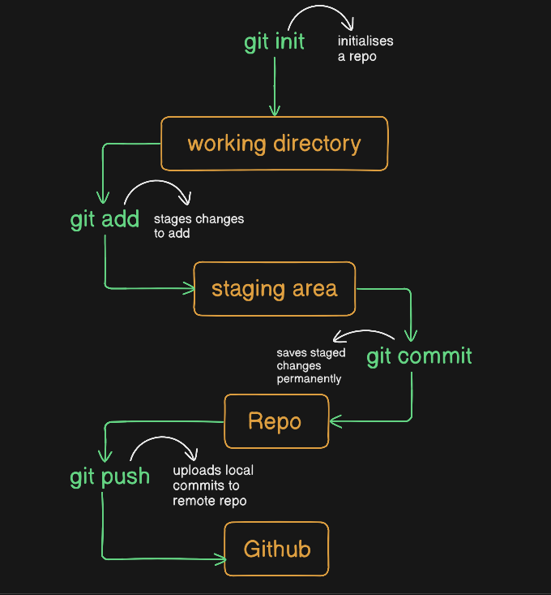

# Git_and_GitHub_complete

- **Git** : A software.
- **GitHub** : A service to host that software online.

- **What is Git ?**
1. Git is a **version control** system that allows you to track changes to your files and let's you collaborate with others.
2. Git is an free and open source software which can be installed on your computer.
3. It is used to manage the history of your code and merge changes from different branches.

- **Download Git from here** - [git-scm.com](https://git-scm.com/)

- **What is GitHub ?**
1. GitHub is a web-based hosting service for **Git repositories**.
2. Github is an online platform that allows you to store and share your code with others.
3. It is a popular platform for developers to collaborate on projects and share code.

- **Git Terminologies and Commands**

1. To check version of your git software - `git --version`

2. **Repository** 
    - A repository is a collection of files and directories that are stored together. 
    - It is a way to store and manage your code. 
    - A repository is like a folder on your computer, but it is more than just a folder. It can contain other files, folders, and even other repositories. You can think of repository as a container that holds all your code.
    - There is a difference between a software on your system vs tracking a particular folder on your system.
    - At any point you can run the following command to see the current state of your repository.

            git status 

3. **Your config settings**
    - Github has lot of settings that you can change.
    - You can change your username, email and other settings, whenever you checkpoint your changes, git will add some information about you such as username and email to the commit.
    - There is a git config file that stores all the settings that you've changed.
    - You can make settings like what editor you would like to use etc.
    - There are some global settings and some repository specific settings.
    - To see all the setting, you can view the config file like this:

            git config
    - In order to change any settings **globally**, you can use

            git config --global user.name "Your Name"
        
 4. **Creating git repository**
     - Creating a repository is a process of creating a new folder on your system and initializing it as a git repository.
     - It's just a regular folder to code your project, you're just asking to track it.
     - To create a repository, you can use following command:

     Always use `git status` first, before creating a new git repository.

     Then, use `git init` to initialise the creation of your repository.

5. **Commit**
    - Commit is a way to save your changes to your repository. 
    - It is a way to record your changes and make them permanent.
    - You can think of a commit as a snapshot of your code at a particular point in time.
    - When you commit your changes, you are telling git to save them in a permanent way.
    - This way, you can always go back to that point in time and see what you changed.

    Usual flow look like this:

    

6. **Complete git flow**
    - A complete git flow, along with pushing the code to github looks like this:
    

7. **Stage**
   - Stage is a way ti tell git to track a particular file or folder.
   - You can use the following command to stage a file:

             git init
             gitt add <file1> <file2>
             git status
    - Here, we are initializing the repository and adding a file to the repository,
    - Then we can see that the file is now being traced by git.
    - Currently our files are in staging area, this means that we have not yet commited the changes but are ready to be commited.

8. **Commit**

            git commit -m "commit message"
            git status

    - Here we are commiting the changes to the repository.
    - We can see that the changes are now commited to the repository.
    - The **-m** flag is used to add a message to the commit.
    - This message is a short description of the changes that were made.
    - You can use this message to remember what changes were made.
    - Missing the **-m** flag will result in an action that opens your default settings editor.

    - **Note** : Git recommends **atomic commits**, which are self-contained units of work. This ensures that each commit focuses on a single change or fix. If an issue arises, you can easily revert that specific commit without affecting other changes, keeping your repository history clean and organized.

9. **Logs**

                git log

    - This command will show you the history of your repository. It will show you all the commits that were made to the repository.
    - You can use the **--oneline** flag to show only the commit message.
    - This will make the output more compact and easier to read.